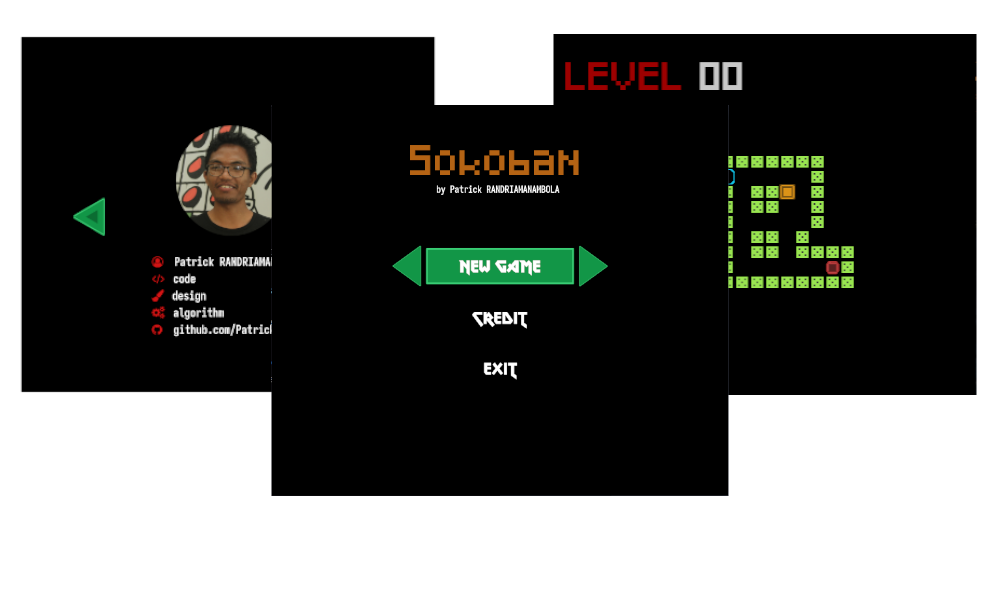

<p align="center"></p>

# Jeu Sokoban

## Prérequis

-SDL2
-SDL2_image
-SDL2_mixer

## Commandes

```bash
make
```
```bash
./sokoban
```

## Commandes clavier

### Menu

Up : selectionne le dessus
Down: selectionne le dessous
Enter: pour valider votre choix

### Le Jeu

-Up : haut
-Down: bas
-Right: Droite
-Left: Gauche
-Esc: Revenir au menu
